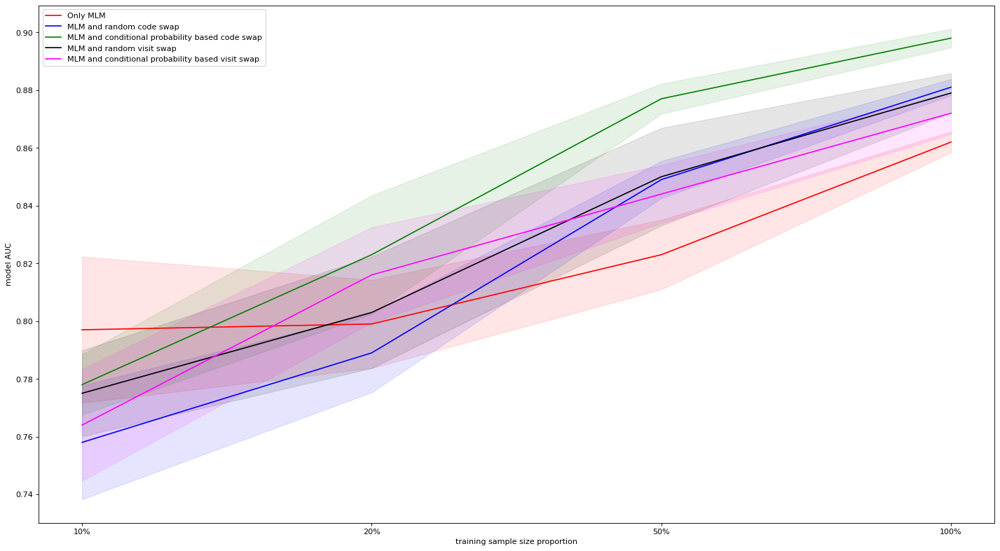

# TOO-BERT: A Trajectory Order Objective BERT for self-supervised representation learning of temporal healthcare data

### Overview

This study introduces TOO-BERT, enhancing MLM representations by explicitly leveraging sequential patient trajectory information at code and visit levels. TOO-BERT excels in learning frequent sequential patterns by refining the TOO self-supervised objective through two proposed methods, Conditional Code Swapping (CCS) and Conditional Visit Swapping (CVS) weighting functions. Evaluation on MIMIC-IV and Malmö Diet cohort datasets demonstrates TOO-BERT's performance in predicting Heart Failure (HF), Alzheimer's disease (AD), and Prolonged Length of Stay (PLS). Notably, TOO-BERT outperforms Bert in HF prediction, even with limited fine-tuning data. Our findings illustrate the potency of integrating TOO objectives in MLM-based models, enabling intricate EHR data relationships to be captured. Attention analysis highlights the model's capability to learn complex structural patterns. For more details, please check the [paper](https://www.researchsquare.com/article/rs-3959125/latest). 

*(a) Code swapping*

*(b) Visit swapping*

Code versus Visits swapping. (a) Code swapping does not alter the visit structures of patient trajec-tories and only substitutes one medical code with another medical code in a different visit. (b) Visits swappingsubstitutes one visit, along with all its contents, with another visit, further disrupting the relative-time-wisedependencies between diagnoses and medications.

Comparison of HF prediction AUC values for the test sets by fine-tuning on different data sizes onthe MIMIC-IV dataset. The shadows represent the 90% confidence intervals.

Trajectory order objective Bert for EHR representation learning.

This software project accompanies the research paper, TOO-BERT: A Trajectory Order Objective BERT for self-supervised representation learning of temporal healthcare data:

https://www.researchsquare.com/article/rs-3959125/v2

For implementing the Bert, we used the following tutorial:

https://github.com/coaxsoft/pytorch_bert
